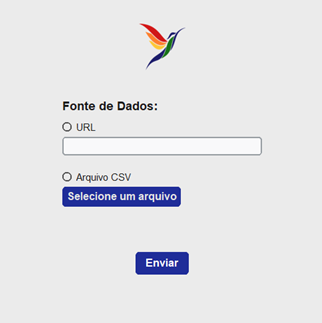

# The Rhamphotheca

A data science project focused on collecting, storing, and analyzing biodiversity data from animal species.

At first, it will focus on publicly available data extracted from WikiAves, a platform containing georeferenced records of bird observations across Brazil.

Later, other data sources may be included as well in order to provide a broader view of the dynamics in Brazilian ecosystems

The long-term goal is to build a complete data pipeline — from automated data extraction to statistical analysis and interactive dashboards — to support the study of species distribution, population trends, and biodiversity patterns.

### Status - Early Development

- Project design has been defined
- Data extraction has been implemented.

### In Progress

- Data Transformation: data extracted from the source will be transformed in order to ensure standardization, clarity, and avoid ambiguity.
- Database Creation: table structure and data types will be defined before loading data into the database.

## 1. Tools

- **Python:** the main programming language used for collecting and analyzing data.
- **CustomTkinter:** library for creating a graphical interface that allows user-initiated data extraction
- **PostgreSQL:** relational database for storing data
- **Flask:** backend web server used to host interactive dashboards to external users

## 2. Current Functionalities

### 2.1. GUI

Menu where the user can select the data source (URL or .csv file)

- **Language:** While the documentation and code will use English to maintain standardization, this project will be mostly focused on Brazilian fauna. As such, the GUI elements will be presented in Portuguese. Other elements and data may also use Portuguese depending on the context.

### 2.2. Data Extraction

Uses Python's request and BeautifulSoup to extract data from records at Wiki Aves.

In order to adhere to ethical data extraction, the following rules were observed:

- Data is collected from publicly accessible pages
- Waiting times were implemented between requests, which will be done with low frequency
- Data will not be redistributed
- This project will be destined for educational purposes only
  However, future improvements are also being planned.

## 3. Planned Features

### 3.1. Data Infrastructure

- Central PostgreSQL database
- Scraping logs and monitoring

### 3.2. Visualization

- Temporal dashboards
- Spatial biodiversity layers
